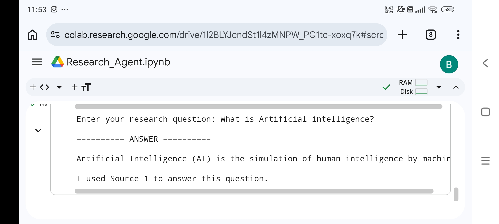
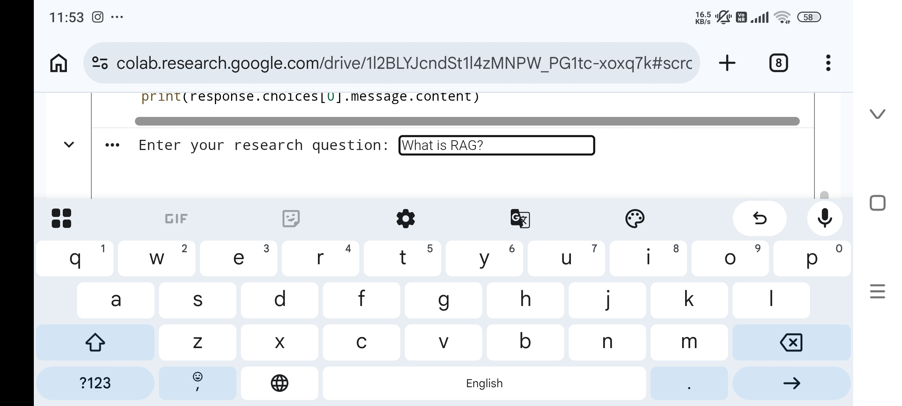
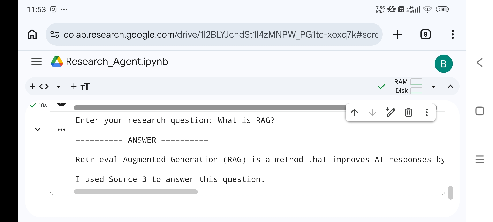

# 🔍 Research Agent with Citations

> An AI-powered Research Agent that answers user questions using only trusted source documents and generates responses with citations.


---

# 📌 Overview

This project was developed as part of the **ROOMAN Technologies – Junior AI Research Associate 24-Hour AI Agent Challenge**.

The Research Agent accepts a user question, retrieves information from the provided source documents, generates an answer using the **Groq Llama 3.3 70B** language model, and includes citations indicating which source was used.

The system is designed to reduce hallucinations by limiting responses to the supplied knowledge base.

---

# 🎯 Objective

Develop an AI Research Agent capable of:

- Accepting natural language questions
- Reading multiple source documents
- Generating grounded answers
- Providing source citations
- Responding honestly when information is unavailable

---

# ✨ Features

- AI-powered Question Answering
- Document-Grounded Responses
- Source Citations
- Groq Llama 3.3 Integration
- Multi-Document Support
- Hallucination Reduction
- Clean Python Implementation
- Easy to Extend with Additional Documents

---

# 🏗️ Architecture

```
                User Question
                      │
                      ▼
         Load Source Documents
                      │
                      ▼
          Build Context for LLM
                      │
                      ▼
          Groq Llama 3.3 70B Model
                      │
                      ▼
        Generate Answer + Citations
                      │
                      ▼
               Display Result
```

---

# 📂 Project Structure

```
research-agent-with-citations/

│
├── app.py
├── README.md
├── requirements.txt
├── sample_questions.txt
│
├── sources/
│   ├── source1.txt
│   ├── source2.txt
│   └── source3.txt
│
├── outputs/
│   ├── output1.txt
│   ├── output2.txt
│   └── output3.txt
│
└── screenshots/
```

---

# ⚙️ Technologies Used

- Python
- Groq API
- Llama 3.3 70B Versatile
- Google Colab
- GitHub

---

# 🚀 Installation

Clone the repository

```bash
git clone https://github.com/Bhavya740/research-agent-with-citations.git
```

Go to the project folder

```bash
cd research-agent-with-citations
```

Install dependencies

```bash
pip install -r requirements.txt
```

Run the application

```bash
python app.py
```

---

# 🔑 API Configuration

1. Create a free API key from:

https://console.groq.com/keys

2. Run the application.

3. Enter your API key when prompted.

---

# ▶️ Example Input

```
What is Retrieval-Augmented Generation?
```

---

# ✅ Example Output

```
Retrieval-Augmented Generation (RAG) retrieves relevant documents before generating an answer.

It helps reduce hallucinations by grounding responses in trusted sources.

Source:
source3.txt
```

---

# 🧠 Workflow

1. User enters a research question.
2. Source documents are loaded.
3. Context is prepared.
4. The context and question are sent to Groq Llama 3.3.
5. The model generates an answer.
6. The answer includes source citations.

---

# 📋 Sample Questions

- What is Artificial Intelligence?
- What is Machine Learning?
- What is Deep Learning?
- What is Generative AI?
- What are Large Language Models?
- What is GPT?
- What is Retrieval-Augmented Generation?
- Why does RAG reduce hallucinations?
- Which source discusses citations?
- Explain neural networks.

---

# 📸 Demo







---

# 📈 Design Decisions

- Groq Llama 3.3 was selected for fast inference and strong language understanding.
- Source-grounded responses reduce hallucinations.
- Text documents were chosen to keep the implementation simple and reproducible.
- The architecture is intentionally modular and easy to extend.

---

# ⚖️ Limitations

- Supports text documents only.
- Uses a small demonstration knowledge base.
- Does not currently perform semantic document ranking.
- Requires a Groq API key.

---

# 🚀 Future Improvements

- PDF and DOCX document support
- Semantic Retrieval using Sentence Transformers
- Vector Database (FAISS / ChromaDB)
- Web Search Integration
- Streamlit Web Application
- Voice-based Research Assistant
- Automatic Document Upload
- Multi-language Support
- Confidence Scoring
- Advanced Citation Ranking

---

# 📦 Deliverables

✔ Runnable Python Application

✔ Source Documents

✔ Sample Questions

✔ Output Examples

✔ Technical Documentation

✔ README

✔ Citations

✔ Tradeoff Notes

---

# 💡 Tradeoffs

This project prioritizes simplicity, readability, and reproducibility.

A lightweight document-grounding approach was chosen to create a reliable end-to-end Research Agent within the challenge timeframe. The design can be extended in the future with semantic retrieval, vector databases, and support for additional document formats.

---


**Bhavya**

**Junior AI Research Associate Challenge Submission**

ROOMAN Technologies Pvt. Ltd.

---

## ⭐ Thank you for reviewing this project.
